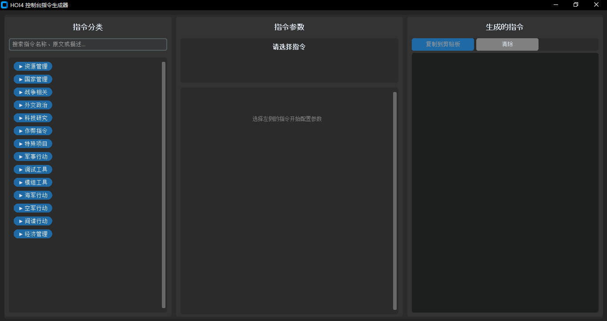

# Hearts of Iron IV Console Commands Tool

<p align="center">
  <a href="README_zh.md">
    
  </a>
</p>

<p align="center">
  
  
  
  
</p>

> 📖 **Available in**: [English](README.md) | [中文](README_zh.md)

## 📖 Overview
This is a fan-made tool that helps you quickly access Hearts of Iron IV console commands through a user-friendly interface. **This is not an official Paradox Interactive product** and is not affiliated with or endorsed by Paradox Interactive.

## ⚠️ Disclaimer
- **Not Official**: This tool is fan-made and not created by Paradox Interactive
- **Early Version**: This is a basic implementation and may contain bugs or incomplete features
- **Use at Your Own Risk**: While we strive for accuracy, there may be errors in command syntax or functionality

## 🚀 Quick Start

### Prerequisites
- Python 3.8 or higher
- Hearts of Iron IV (obviously!)

### Installation
1. Clone the repository:
```bash
git clone https://github.com/your-username/hoi4-console-commands-tool.git
cd hoi4-console-commands-tool
```

2. Install required dependencies:
```bash
pip install -r requirements.txt
```

3. Run the application:
```bash
python main.py
```

## 🎯 Features
- ✅ Command search and filtering (by name, description, and original command)
- ✅ Command categorization with collapsible sections
- ✅ Dynamic parameter input forms
- ✅ Real-time command preview
- ✅ One-click copy to clipboard
- ✅ Chinese interface with original command display
- ✅ JSON-based database for easy expansion

## 🛠️ Project Details
- **Purpose**: Quick access to Hearts of Iron IV console commands
- **Language**: Python
- **GUI Framework**: CustomTkinter
- **Status**: Functional but basic implementation
- **Project Language**: Chinese (UI)

## 📸 Screenshot


## 🔧 How to Expand the Command Database

### Adding New Commands
Simply edit the JSON files in the `data/` folder:

#### 1. Add to `commands.json`
```json
"category_name": {
    "command_name": {
        "description": "command_description",
        "parameters": {
            "parameter_name": {
                "type": "string|int|float|bool|choice",
                "description": "parameter_description", 
                "required": true|false,
                "default": "default_value",
                "placeholder": "placeholder_text",
                "options": ["option1", "option2"]  // for choice type
            }
        }
    }
}
```

#### 2. Add translations to `command_mapping.json`
```json
{
    "command_names": {
        "command_name": "Display Name in Chinese"
    },
    "command_descriptions": {
        "command_name": "Description in Chinese"
    },
    "parameter_names": {
        "parameter_name": "Parameter Name in Chinese"
    },
    // ... other mappings
}
```

#### 3. Add category mapping (if new category)
```json
// In category_mapping.json
{
    "category_name": "Category Name in Chinese"
}
```

### Available Parameter Types
- `string`: Text input field
- `int`: Integer number input
- `float`: Decimal number input  
- `bool`: Checkbox for true/false
- `choice`: Dropdown selection (requires options array)

### Example: Adding a New Command
**Step 1 - Define command in `commands.json`:**
```json
"resource_management": {
    "add_fuel": {
        "description": "add_fuel",
        "parameters": {
            "amount": {
                "type": "int",
                "description": "amount", 
                "required": true,
                "default": "10000"
            }
        }
    }
}
```

**Step 2 - Add translations in `command_mapping.json`:**
```json
{
    "command_names": {
        "add_fuel": "添加燃油"
    },
    "command_descriptions": {
        "add_fuel": "为当前国家添加燃油"
    },
    "parameter_names": {
        "amount": "数量"
    },
    "parameter_descriptions": {
        "amount": "要添加的燃油数量"
    },
    "parameter_placeholders": {
        "amount": "10000"
    }
}
```

**Step 3 - Restart the application** 🎉

## 🗃️ Current Command Coverage
Due to time constraints, we've only implemented a small subset of commands from the official HOI4 wiki. The current database includes:

### Resource Management
- `add_latest_tech` - Add latest technology
- `research_on_icon_click` - Instant research
- `add_equipment` - Add equipment with type selection
- `xp` - Add experience points

### Country Management  
- `annex` - Annex country
- `tag` - Switch control to country

### War & Cheat Commands
- `instantconstruction` - Instant construction
- `winwars` - Immediately win wars
- `fow` - Remove fog of war
- `debug_nuking` - Enable nuke debugging
- `ai` - Disable AI
- `yesman` - AI always accepts diplomatic offers

## 🚧 Known Limitations
- **Limited Command Set**: Only basic commands are implemented
- **Basic UI**: Interface is functional but not polished
- **No Validation**: Some parameter validation may be missing
- **Chinese Only**: Currently only Chinese interface available
- **No Error Recovery**: Application may crash with invalid data

## 🔮 Planned Improvements
- [ ] Add more commands from official wiki
- [ ] Implement command favorites/history
- [ ] Add multi-language support
- [ ] Improve error handling and validation
- [ ] Add command presets and templates
- [ ] Create installer and executable version

## 🤝 Contributing
We welcome contributions! Since this is a basic implementation, there are many areas for improvement:

1. **Add More Commands**: Help expand the command database
2. **Improve UI**: Enhance the user interface and experience  
3. **Add Features**: Implement requested features from users
4. **Fix Bugs**: Help identify and fix any issues

### Contribution Steps
1. Fork the repository
2. Create a feature branch (`git checkout -b feature/AmazingFeature`)
3. Commit your changes (`git commit -m 'Add some AmazingFeature'`)
4. Push to the branch (`git push origin feature/AmazingFeature`)
5. Open a Pull Request

## 📦 Requirements
```txt
customtkinter>=5.2.0
pyperclip>=1.8.2
Pillow>=10.0.0
```

## 👥 Credits
- **Primary Developer**: [dere3046](https://github.com/dere3046)
- **Command Database Source**: [Hearts of Iron IV Official Wiki](https://hoi4.paradoxwikis.com/Hearts_of_Iron_4_Wiki)
- **Special Thanks**: Paradox Interactive for creating an amazing game

## 📄 License
This project is released under the **MIT License** - see the [LICENSE](LICENSE) file for details.

- ✅ Free to use, modify, and distribute
- ✅ Can be used in commercial projects
- ✅ No warranty provided
- ✅ Very few restrictions

---

**Note**: This tool is provided as-is for the HOI4 community. Commands and their effects may change with game updates. Always refer to the official HOI4 wiki for the most current command information.

## 📞 Support
If you encounter any issues or have suggestions:
1. Check the [Issues](https://github.com/your-username/hoi4-console-commands-tool/issues) page
2. Create a new issue if your problem isn't already reported
3. Provide detailed information about the problem

## 🌟 Star History
If you find this project useful, please consider giving it a star! ⭐
