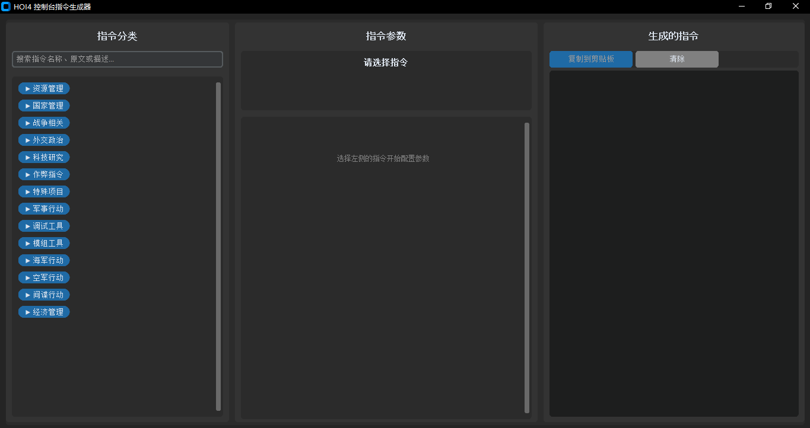

# Hearts of Iron IV 控制台命令工具

<p align="center">
  <a href="README.md">
    
  </a>
</p>

<p align="center">
  
  
  
  
</p>

> 📖 **可用语言**: [English](README.md) | [中文](README_zh.md)
## 📖 概述
这是一个粉丝制作的工具，旨在通过用户友好的界面帮助您快速访问《钢铁雄心4》的控制台命令。**这不是官方的 Paradox Interactive 产品**，与 Paradox Interactive 无关，也未获得其认可。

## ⚠️ 免责声明
- **非官方产品**：此工具为粉丝制作，并非由 Paradox Interactive 创建。
- **早期版本**：这是一个基础实现，可能包含错误或未完成的功能。
- **风险自负**：虽然我们力求准确，但命令语法或功能可能存在错误。

## 🚀 快速开始

### 前置要求
- Python 3.8 或更高版本
- 《钢铁雄心4》（显然需要！）

### 安装步骤
1. 克隆仓库：
```bash
git clone https://github.com/your-username/hoi4-console-commands-tool.git
cd hoi4-console-commands-tool
```

2. 安装所需依赖：
```bash
pip install -r requirements.txt
```

3. 运行应用程序：
```bash
python main.py
```

## 🎯 当前功能
- ✅ 命令搜索与筛选（按名称、描述和原始命令）
- ✅ 带可折叠部分的命令分类
- ✅ 动态参数输入表单
- ✅ 实时命令预览
- ✅ 一键复制到剪贴板
- ✅ 中文界面并显示原始命令
- ✅ 基于 JSON 的数据库，便于扩展

## 🛠️ 项目详情
- **目的**：快速访问《钢铁雄心4》控制台命令
- **编程语言**：Python
- **GUI 框架**：CustomTkinter
- **状态**：功能完整但为基础实现
- **项目语言**：中文

## 📸 截图


## 🔧 如何扩展命令数据库

### 添加新命令
只需编辑 `data/` 文件夹中的 JSON 文件：

#### 1. 添加到 `commands.json`
```json
"category_name": {
    "command_name": {
        "description": "command_description",
        "parameters": {
            "parameter_name": {
                "type": "string|int|float|bool|choice",
                "description": "parameter_description", 
                "required": true|false,
                "default": "default_value",
                "placeholder": "placeholder_text",
                "options": ["option1", "option2"]  // 用于 choice 类型
            }
        }
    }
}
```

#### 2. 添加到 `command_mapping.json`
```json
{
    "command_names": {
        "command_name": "中文显示名称"
    },
    "command_descriptions": {
        "command_name": "中文描述"
    },
    "parameter_names": {
        "parameter_name": "中文参数名"
    },
    // ... 其他映射
}
```

#### 3. 添加类别映射（如果是新类别）
```json
// 在 category_mapping.json 中
{
    "category_name": "中文类别名称"
}
```

### 可用的参数类型
- `string`：文本输入字段
- `int`：整数输入
- `float`：小数输入
- `bool`：真假值复选框
- `choice`：下拉选择（需要提供选项数组）

### 示例：添加新命令
**步骤 1 - 在 `commands.json` 中定义命令：**
```json
"resource_management": {
    "add_fuel": {
        "description": "add_fuel",
        "parameters": {
            "amount": {
                "type": "int",
                "description": "amount", 
                "required": true,
                "default": "10000"
            }
        }
    }
}
```

**步骤 2 - 在 `command_mapping.json` 中添加翻译：**
```json
{
    "command_names": {
        "add_fuel": "添加燃油"
    },
    "command_descriptions": {
        "add_fuel": "为当前国家添加燃油"
    },
    "parameter_names": {
        "amount": "数量"
    },
    "parameter_descriptions": {
        "amount": "要添加的燃油数量"
    },
    "parameter_placeholders": {
        "amount": "10000"
    }
}
```

**步骤 3 - 重启应用程序** 🎉

## 🗃️ 当前命令覆盖范围
由于时间限制，我们仅实现了官方 HOI4 维基中的一小部分命令。当前数据库包括：

### 资源管理
- `add_latest_tech` - 添加最新科技
- `research_on_icon_click` - 即时研究
- `add_equipment` - 添加装备（带类型选择）
- `xp` - 添加经验点

### 国家管理
- `annex` - 吞并国家
- `tag` - 切换控制国家

### 战争与作弊命令
- `instantconstruction` - 即时建造
- `winwars` - 立即赢得战争
- `fow` - 移除战争迷雾
- `debug_nuking` - 启用核弹调试
- `ai` - 禁用 AI
- `yesman` - AI 总是接受外交提议

## 🚧 已知限制
- **命令集有限**：仅实现了基础命令
- **基础 UI**：界面功能完整但不够精美
- **无验证**：可能缺少某些参数验证
- **仅限中文**：目前仅提供中文界面
- **无错误恢复**：应用程序在遇到无效数据时可能崩溃

## 🔮 计划改进
- [ ] 从官方维基添加更多命令
- [ ] 实现命令收藏/历史记录
- [ ] 添加多语言支持
- [ ] 改进错误处理和验证
- [ ] 添加命令预设和模板
- [ ] 创建安装程序和可执行版本

## 🤝 贡献
我们欢迎贡献！由于这是一个基础实现，有许多可以改进的地方：

1. **添加更多命令**：帮助扩展命令数据库
2. **改进 UI**：增强用户界面和体验
3. **添加功能**：实现用户请求的功能
4. **修复错误**：帮助识别和修复问题

### 贡献步骤
1. Fork 本仓库
2. 创建功能分支 (`git checkout -b feature/AmazingFeature`)
3. 提交更改 (`git commit -m '添加了一些神奇功能'`)
4. 推送到分支 (`git push origin feature/AmazingFeature`)
5. 开启一个 Pull Request

## 📦 要求
```txt
customtkinter>=5.2.0
pyperclip>=1.8.2
Pillow>=10.0.0
```

## 👥 致谢
- **主要开发者**：[dere3046](https://github.com/dere3046)
- **命令数据库来源**：[Hearts of Iron IV Official Wiki](https://hoi4.paradoxwikis.com/Hearts_of_Iron_4_Wiki)
- **特别感谢**：Paradox Interactive 创造了如此精彩的游戏

## 📄 许可证
本项目基于**MIT许可证**发布 - 查看 [LICENSE](LICENSE) 文件了解详情。

- ✅ 可自由使用、修改和分发
- ✅ 可用于商业项目
- ✅ 不提供任何担保
- ✅ 限制极少

---

**注意**：本工具按现状提供给 HOI4 社区。命令及其效果可能随游戏更新而改变。请始终参考官方 HOI4 维基以获取最新的命令信息。

## 📞 支持
如果您遇到任何问题或有建议：
1. 查看 [Issues](https://github.com/your-username/hoi4-console-commands-tool/issues) 页面
2. 如果您的问题尚未被报告，请创建新 issue
3. 提供关于问题的详细信息

## 🌟 Star 历史
如果您觉得这个项目有用，请考虑给它一个 star！⭐
